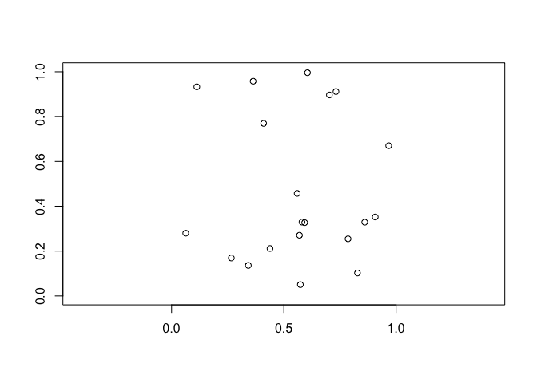
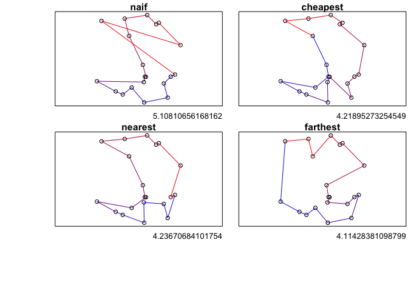

# M2algorithmique Vignette

### Vincent Runge

#### LaMME, Evry Paris-Saclay University

### March 27, 2025

> [Package Presentation](#pp)

> [Quick Start](#qs)

> [Examples](#ex)

> [Analysis](#an)

------------------------------------------------------------------------

<a id="pp"></a>

## Package Presentation

The `M2algorithmique` R/Rcpp package is an **example package** designed
to help students develop their own R/Rcpp packages as part of the **M2
Algorithmic courses in the Data Science master’s program at Université
d’Évry Paris-Saclay**.

This package provides implementations of various algorithmic strategies
in both R and Rcpp, including:

- **Sorting algorithms**: Insertion Sort and Heap Sort  
- **Shortest path algorithms**: Dijkstra’s algorithm with naive, binary
  heap, and Fibonacci heap implementations  
- **Travelling Salesman Problem (TSP)**: Exact Branch and Bound
  algorithm, along with multiple heuristic approaches

This package serves as a reference for students, demonstrating good
practices in algorithm implementation and package development in Rcpp.

------------------------------------------------------------------------

<a id="qs"></a>

## Quick Start

### Prerequisites for Package Development

To develop and use the package, install the necessary dependencies:

``` r
install.packages(c("Rcpp", "RcppArmadillo", "devtools", "roxygen2", "testthat"))
```

### Installing the Package from GitHub

To install the M2algorithmique package, use:

``` r
devtools::install_github("vrunge/M2algorithmique")
```

Then, load the package:

``` r
library(M2algorithmique)
```

### Setting Up a C++ Compiler (Windows Users)

Since Rcpp requires a C++ compiler, Windows users must install Rtools:

Download and install Rtools from:
<https://cran.r-project.org/bin/windows/Rtools/>

For general R updates and additional package downloads, visit the CRAN:
<https://cran.r-project.org/>

### Package Structure

- **One file = one function**: Each function is stored in a separate
  file for clarity.

- **R and C++ function naming convention**:

  - R functions (`fct`) are stored in the `R/` folder.  
  - Their corresponding C++ versions (`fct_Rcpp`) are in the `src/`
    folder.  
  - A **header file** (`.h`) can be used to define functions that are
    accessible across multiple C++ files. In this package, we use for
    example **`TSP_auxiliary.h`** to make the distance function globally
    available to all C++ implementations of heuristic TSP algorithms. To
    use this function in a C++ file, you need to include the header at
    the beginning of the file: `#include "TSP_auxiliary.h"`.

- **Documentation**:

  - Help files for functions are available via `?fct`.  
  - Files in the `man/` folder are automatically generated using
    **Roxygen2**.  
  - To regenerate documentation when installing the package:
    1.  Click **Build** → **More** → **Configure Build Tools…**  
    2.  Enable **Generate Documentation with Roxygen**  
    3.  Click **Configure**, then check **Install and Restart**

- **Key Package Files**:

  - **`DESCRIPTION`**: Modify this file to personalize your package
    (e.g., email, description).  
  - **`NAMESPACE`**: Controls function exports. Customize it to expose
    only desired functions while keeping others internal.  
  - **`.Rbuildignore`**: Excludes files that are unnecessary for package
    building (e.g., the `Pour_les_etudiants/` folder).  
  - **`.gitignore`**: Prevents unnecessary files (e.g., `.o` object
    files) from being tracked on GitHub.

- **Unit tests**. `tests/` folder and `testthat` integration:

  - Unit tests are stored in the `tests/testthat/` folder.  
  - The package uses `testthat` to automate testing and ensure functions
    work correctly.  
  - To avoid warnings during `R CMD check`, `testthat` should be listed
    under **Suggests** in `DESCRIPTION`.

------------------------------------------------------------------------

<a id="ex"></a>

## Examples

### Sorting Algorithms (Recursive)

``` r
n <- 10
v <- sample(n)
v
```

    ##  [1] 10  7  3  2  1  6  8  5  4  9

We implemeted 4 algorithms:

- `insertion_sort`
- `heap_sort`
- `insertion_sort_Rcpp`
- `heap_sort_Rcpp`

They all have a unique argument: the unsorted vector `v`. Examples:

``` r
insertion_sort(v)
```

    ##  [1]  1  2  3  4  5  6  7  8  9 10

``` r
heap_sort_Rcpp(v)
```

    ##  [1]  1  2  3  4  5  6  7  8  9 10

### Dijkstra Algorithms (Dynamic Programming)

### TSP Algorithms (Heuristic)

We generate `n = 20` towns (villes) randomly in a **2D plane** using a
uniform distribution:

``` r
n <- 20
villes <- matrix(runif(2 * n), n, 2)
```

#### Visualization of the Towns

<!-- -->

We implemented **four heuristic** algorithms and **one exact** algorithm
for solving the **Travelling Salesman Problem (TSP)**:

- **Heuristic Approaches:**
  - `TSP_naif` (Naive approach)  
  - `TSP_cheapest` (Cheapest insertion heuristic)  
  - `TSP_nearest` (Nearest neighbor heuristic)  
  - `TSP_farthest` (Farthest insertion heuristic)
- **Exact Algorithm:**
  - `TSP_B_and_B` (Branch and Bound)

Each algorithm also has an equivalent **Rcpp implementation** for
performance optimization.

#### Example

<!-- -->

------------------------------------------------------------------------

<a id="an"></a>

## Analysis

The `Pour_les_etudiants` folder contains the following analysis files:

- **`Sorting_analyse.Rmd`** – Analysis of sorting algorithms  
- **`Dijkstra_analyse.Rmd`** – Analysis of Dijkstra’s algorithm  
- **`TSP_analyse.Rmd`** – Analysis of the Traveling Salesman Problem
  (TSP)

<span style="color:red">These documents, written in French, outline the
type of analysis students are expected to conduct to validate this
course.</span>
